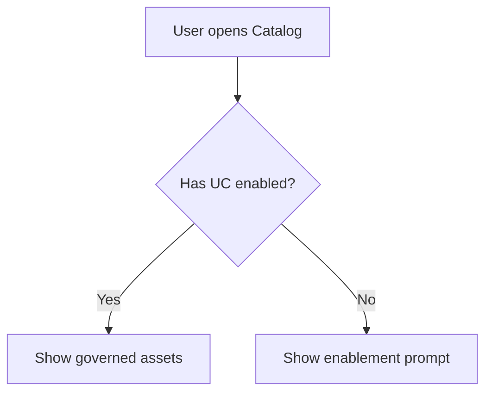

# Research Dispatch — Multi-Agent Playbook

**Primary entry point for the research system.** Read this file first for any research task. Identify the right agents from the dispatch table, spawn them in parallel, then synthesize using the rubric below. For all source links, see the `intel/` folder files listed at the bottom.

**First-time user?** Read `CUSTOMIZE.md` to set up topic-specific files for your product area.

---

## Phase 1: Dispatch — Which agents to spawn

### Agent roster

| Agent | Brief | Best for | Bias direction |
|-------|-------|---------|----------------|
| **Official Docs** | `agents/agent-official-docs.md` | What's shipped, how features work, public positioning | Skews toward shipped/documented; misses unbuilt concepts |
| **Community Voice** | `agents/agent-community-voice.md` | What users want, complain about, or praise (public) | Skews toward vocal power users; underrepresents silent churners |
| **Internal Intel** | `agents/agent-internal-intel.md` | UXR archive, PRDs, strategy, PM customer notes, ES tickets, CUJs, prior design work | Skews toward past internal thinking; may anchor to prior approaches |
| **Competitive** | `agents/agent-competitive.md` | How competitors approach this, battlecard positioning | Skews toward Databricks-favorable framing from battlecards |
| **Quantitative** | `agents/agent-quantitative.md` | Usage data, adoption metrics, funnel analysis, SimpleBricks/CUJ scores | Can only measure instrumented features; zero ≠ no demand |
| **Market Landscape** | `agents/agent-market-landscape.md` | Broader market context, analyst views, vendor ecosystem | Analyst views lag 6-18 months; overrepresents funded vendors |
| **Roadmap & Planning** | `agents/agent-roadmap-planning.md` | Active/planned work, quarterly commitments, leadership priorities | Skews toward formally planned work; misses grassroots efforts |
| **Foundations** | `agents/agent-foundations.md` | Academic grounding, standards, external knowledge, concept definitions | Skews theoretical; may over-index on ideal-state vs. practical reality |
| **Sales & GTM** | `agents/agent-sales-gtm.md` | Field signal, deal dynamics, win/loss, GTM positioning, PMM messaging | Skews toward deal-winning narratives; "sells well" ≠ "works well" |
| **Product Design** | `agents/agent-product-design.md` | UX patterns, competitor UX, design implications, interaction models | Skews toward UX elegance; may underweight feasibility or business constraints |

### Dispatch patterns by question type

| Research question type | Agents to spawn |
|-----------------------|----------------|
| "What do users need / complain about?" | Community Voice + Internal Intel (customer notes) |
| "How does our feature compare to competitors?" | Official Docs + Competitive + Community Voice + Product Design |
| "Should we build X?" | Community Voice + Internal Intel + Competitive + Quantitative + Foundations |
| "How is feature X being adopted?" | Quantitative + Internal Intel |
| "What's the market opportunity for X?" | Market Landscape + Competitive + Quantitative |
| "Why are we winning or losing deals on X?" | Sales & GTM + Competitive |
| "What is the field / sales team hearing about X?" | Sales & GTM |
| "Is this already being built or planned?" | Roadmap & Planning |
| "What did leadership prioritize this FY?" | Roadmap & Planning |
| "What is the current messaging / positioning for X?" | Roadmap & Planning + Sales & GTM |
| "What's broken / what are customers escalating?" | Internal Intel (ES tickets) + Quantitative |
| "How simple / usable is this flow?" | Quantitative (SimpleBricks) + Internal Intel (CUJs) + Product Design |
| "What's shipping soon in this area?" | Roadmap & Planning + Official Docs |
| "What is [concept] and how should we approach it?" | Foundations + Market Landscape + Competitive + Product Design |
| "How do other products design [feature]?" | Product Design + Competitive |
| "What's the academic/industry definition of X?" | Foundations |
| "Full product research (any topic)" | All 10 agents |
| "Quick UX decision / prior art check" | Official Docs + Internal Intel + Product Design |
| "Competitive positioning for a design review" | Official Docs + Competitive + Sales & GTM + Product Design |
| "What should the GTM strategy be for X?" | Sales & GTM + Roadmap & Planning + Competitive |

---

## Phase 2: Agent output format

Every agent must return findings in exactly this structure. This makes synthesis mechanical.

### Inline citation rule (ALL agents)

**Every claim must have an inline citation.** Use sequential numbers `[1]`, `[2]`, etc. within each agent's findings. These get renumbered during synthesis into a unified References section.

Format: `Users reported confusion with tag inheritance [2]` — where `[2]` maps to a specific source in the agent's references list.

For the Quantitative agent specifically: every data point must cite the exact Logfood table queried and the date.

```markdown
## [Agent Name] Findings

**Research question:** [exact question passed to this agent]
**Sources checked:** [list every source actually consulted — with URLs where available]
**Date:** [today's date]
**Bias direction:** [one sentence — copied from the agent brief's bias tag]

### Key findings
- [Finding 1 — one sentence, specific, with inline citation [N]]
- [Finding 2 [N]]
- [Finding 3 [N]]
(up to 7 findings; rank by importance to the research question)

### Supporting evidence
| # | Claim | Source | Quote / Data point | Citation |
|---|-------|--------|-------------------|----------|
| 1 | ...   | [source name + URL] | ...      | [1]      |
| 2 | ...   | [source name + URL] | ...      | [2]      |

### Gaps and unknowns
- [What this agent could not find or verify]
- [Questions that remain open after this search]

### References (agent-level)
[1] [Source label] — [URL or go-link] (accessed [date])
[2] [Source label] — [URL or go-link] (accessed [date])

### Coverage Confidence
- **Source depth:** High / Medium / Low — [did you find multiple independent sources?]
- **Recency:** High / Medium / Low — [are sources from the current or previous quarter?]
- **Relevance:** High / Medium / Low — [how directly did sources address the research question?]
- **Overall:** High / Medium / Low
- **Reason:** [one sentence explaining confidence level]
```

---

## Phase 3: Synthesis — Judge instructions

The synthesis judge receives all agent findings and produces one unified answer.

### Coverage Confidence check (run first)

Before synthesizing, assess the coverage:

1. **Count substantive returns.** How many of the dispatched agents returned meaningful findings (not just "no data found")?
   - **≥ 70% of agents returned substantive findings** → Proceed with synthesis normally
   - **40-69% returned substantive findings** → Flag as **partial coverage** — note which dimensions are missing and why
   - **< 40% returned substantive findings** → Flag as **under-researched topic** — the synthesis should lead with this caveat and recommend primary research (user interviews, deeper investigation, or consulting specific teams)

2. **Check for dimension gaps.** Even if most agents returned findings, are any critical perspectives missing?
   - No internal data (Quantitative returned empty) → "Adoption data unavailable — findings are qualitative only"
   - No external grounding (Foundations returned empty) → "No academic or standards context — findings reflect Databricks-internal framing only"
   - No customer voice (Community Voice + customer notes empty) → "No direct customer signal — findings reflect internal/analyst perspective only"
   - No design prior art (Product Design returned thin) → "No UX patterns identified — design exploration needed before implementation"

3. **Report the coverage signal** in the synthesis header so stakeholders know what they're looking at.

### Trust hierarchy (use when agents conflict)

When two agents report conflicting information, the higher-ranked source wins:

| Rank | Source type | Why |
|------|------------|-----|
| 1 | **Logfood quantitative data** (incl. GTM Silver/Gold) | Actual observed behavior — not opinion |
| 2 | **Internal PRDs + strategy docs** | Reflects intent, roadmap, and internal decisions |
| 3 | **Official Databricks docs** | What's shipped and publicly committed to |
| 4 | **Customer Notes + PM field notes / data_voices** | Direct customer signal; structured by PMs from live calls |
| 4 | **Win/loss data (SFDC Compete360 + Win/Loss Tracker)** | Direct deal signal; explains real-world customer decisions |
| 5 | **Industry standards + canonical academic sources** | Established definitions; high authority for "what is X?" questions |
| 5 | **Sales field signal (BrickBites, Win Wires, QBRs)** | Anecdotal but from the field; useful for narrative and pattern |
| 6 | **Community / Ideas Portal** | Broader public signal, may lag internal knowledge |
| 7 | **Competitive battlecards** | Databricks-framed — useful but not neutral |
| 8 | **External analysts (Gartner, Forrester)** | Independent but lagging; 6–18 month delay typical |
| 9 | **External blogs / practitioners** | Opinion-based; useful for trends, low authority |

### Synthesis output format

The synthesis document is **findings-first**. Research methodology, agent roster, coverage diagnostics, and raw agent outputs go in the Appendix — not the main body. Readers care about *what you found*, not *how the research system works*.

```markdown
## [Research Question]

**Date:** [today's date]
**Confidence:** [High / Medium / Low] — [one sentence explaining what drives or limits confidence]

### Executive Summary
[2–4 sentence direct answer to the research question. Bold the key insight. This is the TL;DR — a busy stakeholder should be able to read only this and walk away informed.]

---

### Key Themes

#### 1. [Theme name]
[1–2 paragraph narrative of what multiple agents agreed on. Weave in inline citations [1] [2] throughout. Don't just list bullet points — tell the story of this theme.]

#### 2. [Theme name]
[Same structure]

#### 3. [Theme name]
[Same structure]

---

### Conflicts & Resolutions
| Conflict | One side | Other side | Resolution | Basis |
|----------|----------|------------|------------|-------|
| ...      | ... [N]  | ... [N]    | ...        | [trust hierarchy rank] |

(Omit this section if no conflicts found — don't include an empty table.)

---

### Gaps & Recommended Next Steps
- [What no agent could answer — be specific about *why* it's unknown]
- [Recommended follow-up action + who should own it]

(Omit if no meaningful gaps.)

---

### Product Design Implications

> This is a single, consolidated section at the end of the main body — produced by the Product Design agent after reading all other agents' findings. Do NOT scatter design implications throughout themes. This section provides a cohesive design-oriented conclusion to the research.

#### User mental model
[How should users think about this concept? What existing Databricks concepts does this extend or conflict with?]

#### Key interaction patterns
- **[Pattern 1]:** [Interaction model + reference [N]]
- **[Pattern 2]:** [Interaction model + reference [N]]

#### Information architecture considerations
- [Where should this live? What navigation model?]
- [What should be visible by default vs. progressive disclosure?]

#### UX risks & anti-patterns
- [What could go wrong from a UX perspective?]

#### Design questions to resolve
- [Open question 1 — requires prototyping, user research, or stakeholder alignment]
- [Open question 2]

#### Recommended design next steps
- [ ] [Specific action]
- [ ] [Specific action]

#### Explore these ideas
> For any design concept or interaction pattern described above, you can generate a visual prototype to communicate the idea. Copy the relevant section and use `/frontend-design` to create an interactive HTML mockup, or paste into Figma with the Databricks Design System components.

- **Interactive mockup:** Ask Isaac `/frontend-design [describe the concept]` to generate a standalone HTML page with the proposed UX pattern
- **Figma starting point:** Use the Databricks DS Figma library — search for relevant components and assemble a quick comp

---

### References

All sources cited in this document. Grouped by type, numbered sequentially.

**Internal data**
[1] [Source label] — [Logfood table or go-link] (queried/accessed [date]) — surfaced by: [Agent]
[2] ...

**Internal documents**
[N] [Source label] — [URL or go-link] (accessed [date]) — surfaced by: [Agent]

**External sources**
[N] [Source label] — [URL] (accessed [date]) — surfaced by: [Agent]

---

### Appendix

#### A. Research methodology
**Agents consulted:** [list with one-line description each]
**Coverage:** [Full | Partial | Under-researched] — [X of Y agents returned substantive findings]
**Dimension gaps:** [list any missing perspectives, or "None"]
**Trust hierarchy applied:** [brief note on which levels were invoked to resolve conflicts]
**Dispatch pattern matched:** [which row from the dispatch table]

#### B. [Agent Name] — Detailed Findings
[Full agent output: all findings, evidence table, SQL queries (for Quantitative), extended quotes, screenshots, raw data. Preserves the complete research record.]

#### C. [Agent Name] — Detailed Findings
[...]

(Continue for each agent that returned substantive findings. Skip agents that returned empty.)
```

---

## Phase 4: Output presentation — Google Doc publishing

The final output must be published as a well-formatted Google Doc. Research findings are consumed by stakeholders who need a polished, readable document.

### Publishing workflow (step by step)

**Step 1: Write markdown to a temp file**
Write the full synthesis markdown to a local temp file (e.g., `~/.cursor/docs/research/output/research-output.md`). This avoids context window overhead and produces better formatting.

**Step 2: Create or update the Google Doc**
- **New research:** Use `mcp__google__docs_document_create_from_markdown` with `markdown_file_path` pointing to the temp file
- **Follow-up on existing research:** Use `mcp__google__docs_document_inspect_structure` to get the doc's `total_length`, then use `mcp__google__docs_document_batch_update` to append at that index. **NEVER delete and recreate the doc** — this destroys the URL that stakeholders may have bookmarked or linked in Slack/Confluence.

**Step 3: Post-process formatting**
After creating the doc, use `mcp__google__docs_document_inspect_structure` then `mcp__google__docs_document_batch_update` to fix any formatting that markdown couldn't express (table styling, code block formatting, etc.).

**Step 4: Set permissions**
Use `mcp__google__drive_file_update` to move to the appropriate folder if needed. Share the doc URL with the user — note that programmatic permission setting is not available via MCP, so remind the user to set sharing to "Anyone at Databricks with the link can comment" if they want broad access.

**Step 5: Save to memory**
Save the doc URL and document_id to memory so follow-up research can update the same doc.

**Document naming convention:** `Research: [Topic] — [Date]`

### Document structure

The Google Doc follows this structure. **The main body is findings-first** — research methodology and raw agent outputs go in the Appendix.

```
Title (H1): Research: [Research Question]
Subtitle: [Date] · Confidence: [level] · [X agents consulted]

─── Executive Summary (H2) ───
[2-4 sentences. Bold the key insight.]

─── Key Themes (H2) ───
  Theme 1 (H3): [narrative with inline citations [1] [2]]
  Theme 2 (H3): [narrative]
  Theme 3 (H3): [narrative]

─── Conflicts & Resolutions (H2) ───
[Table — omit section entirely if no conflicts]

─── Gaps & Recommended Next Steps (H2) ───
[Bulleted — omit section entirely if no gaps]

─── Product Design Implications (H2) ───
  [Single consolidated section at the end of the main body]
  [Sub-sections as H3: mental model, patterns, IA, risks, questions, next steps]
  [Includes "Explore these ideas" with links to /frontend-design and Figma]

─── References (H2) ───
[Numbered, grouped by type: Internal data → Internal docs → External]

─── Appendix (H2) ───
  A. Research Methodology (H3): agents, coverage, dispatch pattern, trust hierarchy
  B–K. Agent Detailed Findings (H3 each): full raw output per agent
```

### Formatting rules

#### Headings
Use markdown heading levels correctly: `#` for title, `##` for major sections, `###` for sub-sections. The `create_from_markdown` tool converts these to Google Docs heading styles that enable the doc outline.

#### Tables
- **Only include columns that have data.** Never add empty columns. Never add empty rows.
- Every table must have a header row. Every cell must have content — if a cell would be empty, write "N/A" or omit the row entirely.
- Keep tables focused: 3–5 columns max. If you need more columns, split into multiple tables.
- Test your markdown table syntax: ensure `|` pipe characters are aligned and every row has the same number of columns as the header.

#### Code blocks (SQL, config, API examples)
Use fenced code blocks with language identifiers:
````
```sql
SELECT COUNT(*) FROM main.eng_data_gov_ds.unity_catalog_customer_metric_daily
WHERE date >= '2026-01-01'
```
````
The `create_from_markdown` tool renders these as monospace formatted blocks in Google Docs. **Do not use inline backticks for multi-line code** — always use fenced blocks.

#### Lists
- Use `-` for unordered lists, `1.` for ordered lists
- Nested lists: indent with 2 spaces
- Don't mix list styles within a section
- Every list item must have content — no empty bullets

#### Inline citations
Use `[N]` format throughout the document. Every factual claim must have a citation. Bold the citation number when it's from a high-signal source (Logfood data, PRDs): **[1]**

#### Diagrams and visual content

When a concept benefits from a visual (architecture, user flow, concept map, data model):

1. **Generate a Mermaid diagram** in a fenced code block:
````

````

2. **Describe suggested visuals** when you can't generate them directly:
> **Suggested visual:** Funnel diagram showing UC onboarding: Workspace Created → UC Enabled → First Table Registered → First Policy Applied. Include drop-off percentages at each stage from Logfood data.

3. For quantitative data, present numbers in clean tables rather than attempting chart images. Structure the table so trends are visually scannable (e.g., month columns left to right).

#### Empty sections
**Never include a section with no content.** If "Conflicts & Resolutions" has no conflicts, omit the section entirely rather than showing an empty table. If a sub-section of Product Design Implications has nothing to say, omit it. An empty section signals sloppy work.

#### Bold and emphasis
Bold key terms on first use and key insights in the Executive Summary. Italicize book/report titles. Don't over-format.

### Follow-up research (CRITICAL — preserve the URL)

When the user asks follow-up questions or wants additional research on the same topic:

1. **Default behavior: update the existing doc in place.** Check memory for the doc URL/ID from the previous research session.
2. If the doc exists:
   - Use `mcp__google__docs_document_export_as_markdown` to get the current content
   - **Surgically update only the sections that changed** — use `find_replace` or targeted `modify_text` operations via `batch_update`. Do NOT rewrite the entire doc.
   - If a theme needs updating: update that theme's section with new findings and citations
   - If new themes emerged: insert new theme sections in the appropriate location
   - If the Executive Summary needs revision: update it to reflect the expanded research
   - **Add new references** to the References section (continue numbering)
   - **Update the Appendix** with new agent findings
   - Add a "Last updated: [Date] — [follow-up question]" line below the subtitle
3. **Only create a new doc if the user explicitly asks** ("start fresh", "new doc", "wipe it").
4. Always confirm: "I found the existing research doc [URL]. I'll update the relevant sections — or would you prefer a fresh doc?"
5. The URL must never change. The doc must never be deleted and recreated.

---

## How to invoke this system (instructions for Isaac)

When the user asks a research question, follow this sequence:

### Phase 1: Dispatch
1. Read this file and identify the right dispatch pattern from the table above
2. **Check memory** for an existing Google Doc on the same or related topic — if found, default to appending
3. For each required agent, read its brief from `agents/agent-[type].md`
4. Spawn all agents in parallel (single message, multiple Agent tool calls)
   - **Quantitative agent:** Must actually execute SQL queries — not just list them. Pass the Databricks MCP tools explicitly.
   - **All agents:** Must use inline citations `[N]` for every factual claim

### Phase 2: Collection
5. Wait for all agents to return findings in the standard format
6. Collect all references (URLs, doc links, go-links) from every agent
7. **Renumber all citations** into a single unified sequence for the synthesis

### Phase 3: Synthesis
8. Run the **Coverage Confidence check** — assess how many agents returned substantive findings and flag dimension gaps
9. Apply the synthesis rubric: identify themes, resolve conflicts using the trust hierarchy, note gaps
10. Pass all agent findings to the **Product Design agent (Job 2)** to produce the Product Design Implications section
11. Compile the full synthesis — **findings-first structure** (methodology goes in Appendix, not the main body)
12. **Omit any section that has no content.** No empty sections, no empty tables, no empty table columns or rows.

### Phase 4: Publish
13. **Write the synthesis markdown to `~/.cursor/docs/research/output/research-output.md`** — use the Write tool
14. Create or update the Google Doc:
    - **New doc:** `mcp__google__docs_document_create_from_markdown` with `markdown_file_path: "~/.cursor/docs/research/output/research-output.md"`
    - **Existing doc (follow-up):** `inspect_structure` to get `total_length` → `batch_update` to append at that index
15. **Post-process formatting:** Use `inspect_structure` + `batch_update` to verify tables rendered correctly, code blocks are styled, no empty sections exist
16. Share the doc URL with the user — remind them to set sharing to "Anyone at Databricks with the link can comment"
17. **Save the doc URL and document_id to memory** so follow-up research updates the same doc

**Do not start synthesizing until all agents have returned.** If one agent fails or finds nothing, note it as a gap rather than skipping synthesis.

**Shared taxonomy:** All agents should tag their key findings using `TAGS.md` (source type, business function, signal quality, topic domain). This makes synthesis and conflict resolution mechanical.

**Bias awareness:** Each agent's brief includes a "Bias direction" tag. The synthesis judge should note when the overall finding might be skewed by agent-level biases and explicitly call out where cross-referencing corrected or confirmed a potentially biased finding.

---

## System files

| File | Role |
|------|------|
| `INDEX.md` (this file) | Entry point: dispatch patterns, 10-agent roster, output format, synthesis rubric, coverage confidence |
| `CUSTOMIZE.md` | Setup & customization guide for new users — which files to personalize |
| `TAGS.md` | Shared tag taxonomy for consistent labeling across all agents |
| `output/` | Research output artifacts — markdown files written before Google Doc publishing. Check this folder when launching new research to see prior outputs on the same or related topics. |
| **Intel modules** | |
| `intel/governance-intel.md` | ⚙️ **Customize** — Topic-specific Databricks doc links (ships with governance; replace for your area) |
| `intel/external-intel.md` | Universal external sources: community, Ideas Portal, blogs, analysts, video |
| `intel/internal-intel.md` | All internal sources: Glean, go-links, Confluence, Slack, Logfood, UXR |
| `intel/competitive-intel.md` | CI resources + playbook for all competitive question types |
| `intel/landscape-intel.md` | MAD landscape guide + full ~1,200 company catalog |
| `intel/db-data.md` | ⚙️ **Customize** — Logfood schemas and workspace access template |
| `intel/product-design-intel.md` | Industry design sources: NNGroup, design systems, competitor UX, visualization, accessibility |
| `~/.cursor/docs/data-ai-voices.md` | **Standalone** — Compendium of data + AI voices (lives outside the research toolkit; intended for web presentation) |
| **Agent briefs** | |
| `agents/agent-official-docs.md` | What Databricks has shipped and documented |
| `agents/agent-community-voice.md` | Public user sentiment: forums, Reddit, Ideas Portal |
| `agents/agent-internal-intel.md` | Internal R&D knowledge: PRDs, UXR, customer notes, ES tickets, CUJs |
| `agents/agent-competitive.md` | Competitor features, positioning, and battlecards |
| `agents/agent-quantitative.md` | ⚙️ **Customize** — Logfood usage data, adoption metrics, funnels |
| `agents/agent-market-landscape.md` | Market context, analyst views, vendor ecosystem |
| `agents/agent-roadmap-planning.md` | Active/planned work, quarterly commitments, leadership priorities |
| `agents/agent-foundations.md` | Academic grounding, standards, external knowledge, concept definitions |
| `agents/agent-sales-gtm.md` | Field signal, deal dynamics, win/loss, GTM strategy, PMM messaging |
| `agents/agent-product-design.md` | UX patterns, competitor UX, design implications (dual role: research + synthesis) |
